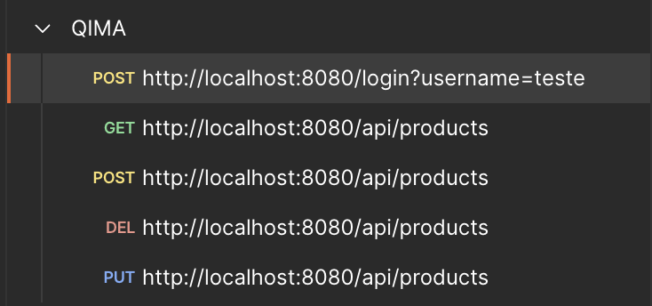
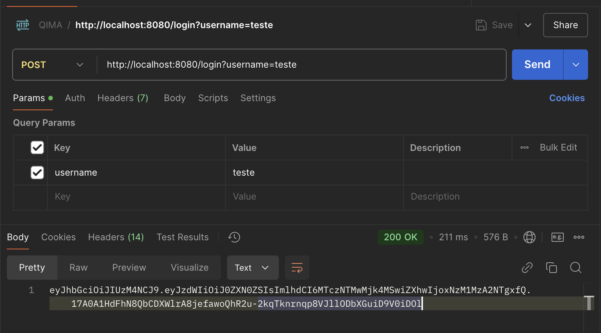
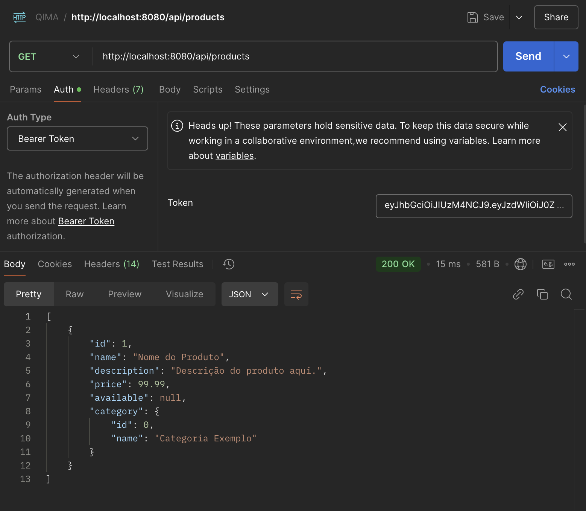
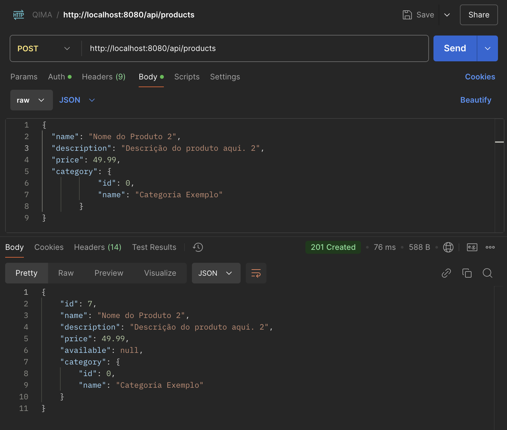
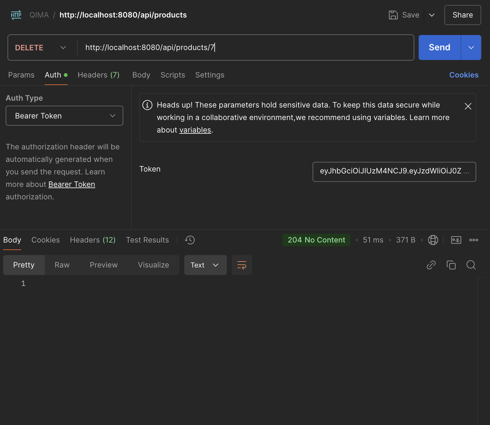
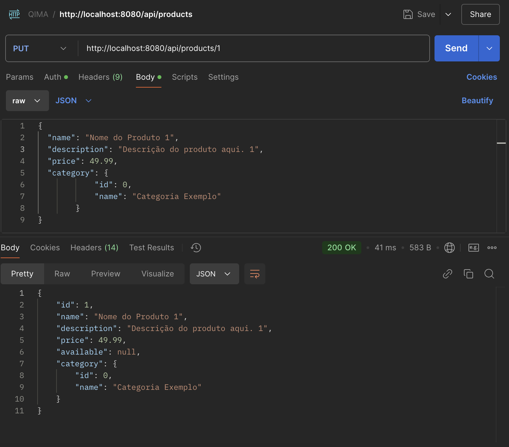
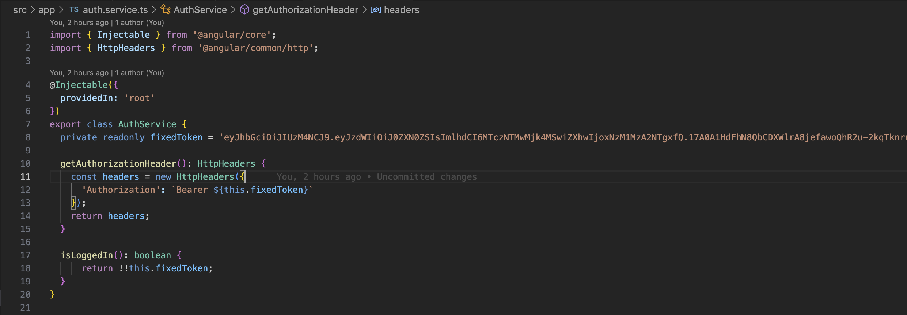

# qimatech_fullstack_test
Fullstack project for test QIMA Tech

```
QIMAtech_FullStack
│
├── backend/
│   ├── src/
│   │   ├── main/java/com/qimatech/
│   │   │   ├── controller/
│   │   │   ├── model/
│   │   │   ├── repository/
│   │   │   ├── service/
│   │   │   ├── config/
│   │   │   └── QimaTechApplication.java
│   │   └── resources/
│   │       ├── application.properties
│   └── pom.xml
│
└── frontend/
    ├── src/
    │   ├── app/
    │   │   ├── product/
    │   │   │   ├── product-list.component.ts
    │   │   │   ├── product-list.component.html
    │   │   │   ├── product-form.component.ts
    │   │   │   ├── product-form.component.html
    │   │   │   ├── product.service.ts
    │   │   │   └── models/
    │   │   │       └── product.model.ts
    │   │   ├── app.module.ts
    │   │   └── app-routing.module.ts
    ├── angular.json
    ├── package.json
    ├── tsconfig.app.json
    ├── tsconfig.json
    └── tsconfig.spec.json
```

### Backend:

**Paths**:

- mvn clean install -U
- mvn spring-boot:run



Endpoint para gerar o token:
POST: http://localhost:8080/login?username=teste



Endpoint para buscar lista de produtos com Bearer Token
GET: http://localhost:8080/api/products



Endpoint para adicionar item com Bearer Token
POST: http://localhost:8080/api/products



Endpoint para deletar item com Bearer Token
DEL: ttp://localhost:8080/api/products/{{id}}



Endpoint para editar item com Bearer Token
PUT: http://localhost:8080/api/products/{{id}}




### Frontend

Substituir o bearen token gerado no backend no arquivo auth.service:



- npm start